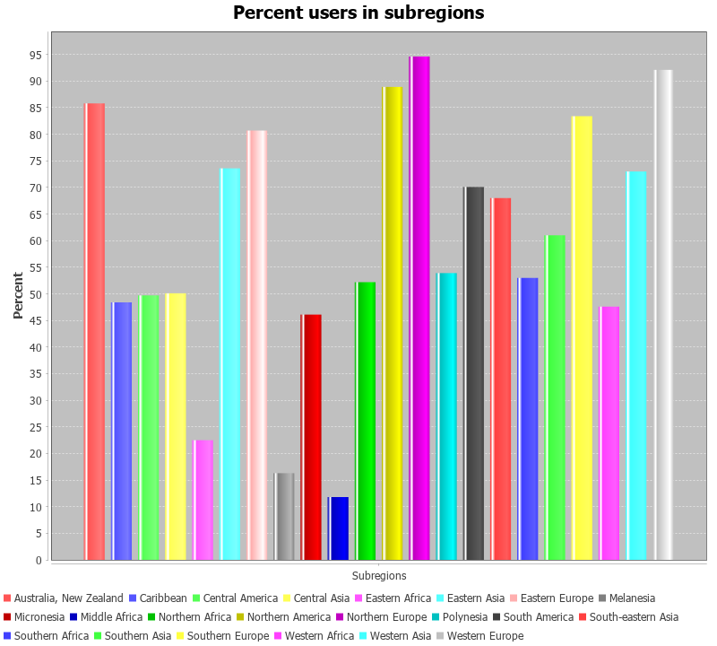

# Практика

1. betweenCountInContry

Находит страны, процент пользователей которых находится в промежутке от 75% до 85%

2. Country

Выводит процент количества пользователей интернета от всех людей в каждом субрегионе в виде графика в формате PNG

3. minCountry

Находит страну с самым наименьшим количеством зарегистрированных пользователей в интернете
